# PID-Based Arduino Control System

An Arduino-based control system that uses a **PI controller** for distance regulation with ultrasonic sensing, monitors environmental conditions with a **DHT22 sensor**, and adjusts motor operation based on safety thresholds. Real-time feedback is provided through LEDs, an LCD display, and the Serial Monitor.

---

## 📑 Table of Contents

1. [Overview](#overview)
2. [Features](#features)
3. [System Architecture](#system-architecture)
4. [Hardware Requirements](#hardware-requirements)
5. [Software Requirements](#software-requirements)
6. [Installation](#installation)
7. [Usage](#usage)
8. [Simulation](#simulation)
9. [Project Workflow](#project-workflow)
10. [Future Improvements](#future-improvements)
11. [License](#license)

---

## 📖 Overview

This project demonstrates the implementation of a **PID control system** in an embedded environment.

* The **mathematical model** of the characteristic equation was derived using engineering mathematics.
* **MATLAB** was used to simulate the PID response and tune controller parameters.
* The tuned values were then implemented into an **Arduino sketch**, compiled into a HEX file, and simulated in **SimulIDE** for validation.

The system combines **control theory, simulation, and embedded programming** to regulate distance and ensure safe operation based on sensor feedback.

---

## ⚡ Features

* PI controller for **distance regulation** using an **HC-SR04 ultrasonic sensor**

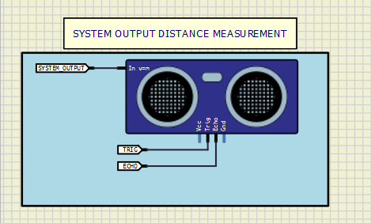
  
* **Temperature and humidity monitoring** with DHT22 sensor
  
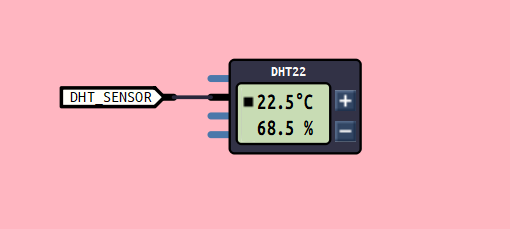
  
* **Motor control** with safety thresholds

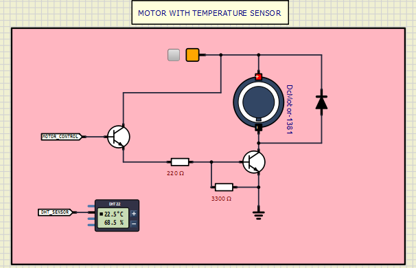
  
* **LED indicators** for system states and warnings

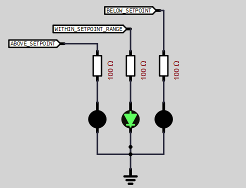
  
* **LCD display** for real-time status updates

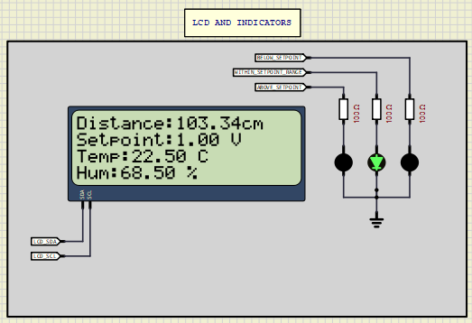
  
* **Serial Monitor logging** for debugging and analysis

**1. Open The Monitor**
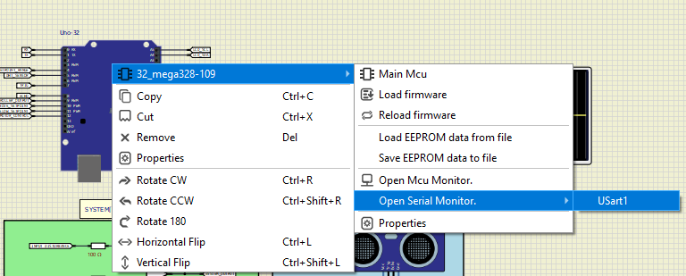


**2. Monitor Logs**
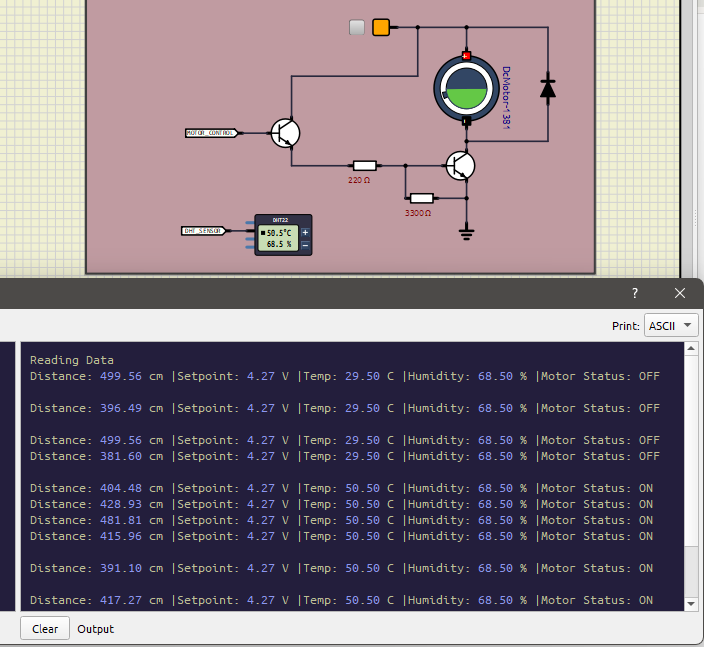
  
* Exportable **firmware (HEX file)** for easy deployment on Arduino

---

## 🏗️ System Architecture

```
[ Ultrasonic Sensor ] → [ PI Controller ] → [ Motor Driver ]
[ DHT22 Sensor ] → [ Safety Logic ] → [ Motor / LEDs / LCD ]
[ Arduino ] ↔ [ Serial Monitor / SimulIDE ]
```

---

## 🔧 Hardware Requirements

* Arduino Uno (or compatible board)
* HC-SR04 Ultrasonic Sensor
* DHT22 Temperature & Humidity Sensor
* DC Motor + Motor Driver (e.g., L298N)
* LCD (16x2 with I2C or parallel interface)
* LEDs (status indicators)
* Breadboard, wires, and power supply

---

## 💻 Software Requirements

* [MATLAB](https://www.mathworks.com/) (for PID tuning & simulation)
* [Arduino IDE](https://www.arduino.cc/en/software) (for coding & HEX export)
* [SimulIDE](https://simulide.blogspot.com/) (for circuit simulation)

---

## ⚙️ Installation

1. Clone this repository:

   ```bash
   git clone https://github.com/your-username/your-repo-name.git
   cd your-repo-name
   ```
2. Open the `.ino` file in **Arduino IDE**.
3. Install required libraries:

   * `DHT.h` for DHT22
   * `LiquidCrystal_I2C.h` (if using I2C LCD)
4. Compile and upload to your Arduino.
5. (Optional) Export the `.hex` firmware for simulation in **SimulIDE**.

---

## 🚀 Usage

* Place the ultrasonic sensor in front of the object to measure distance.
* The motor will adjust speed/direction based on the PI controller’s output.
* If unsafe conditions are detected (e.g., high temperature, unsafe distance), the system triggers LEDs and may shut down the motor.
* Monitor system logs on the Serial Monitor or LCD.

---

## 🧪 Simulation

* Use **MATLAB** to test and tune the PID parameters before deployment.
* Load the Arduino HEX firmware into **SimulIDE** for circuit simulation.

**How To:**
  i. Open SimulIDE.exe
  
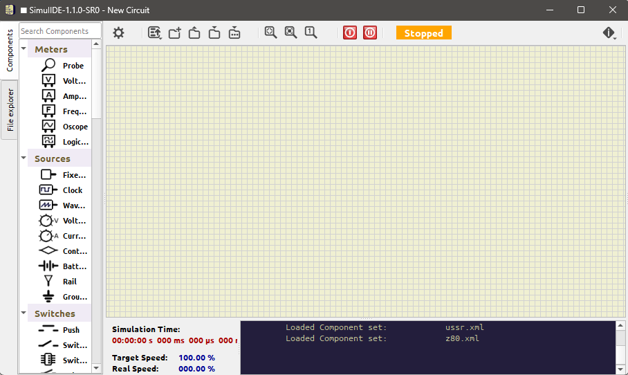
  
  ii. Load Schema (Drag and Drop the micro_project.sim1 on the Grid)

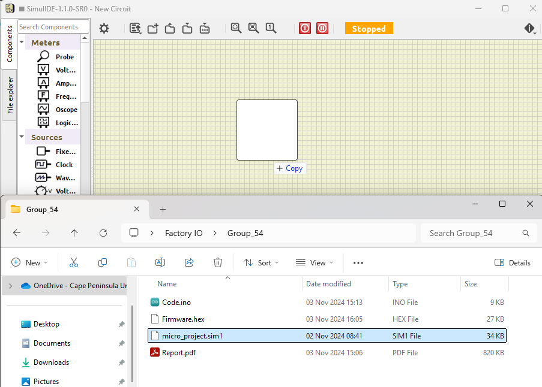
  
  iii. Loaded Schema
  
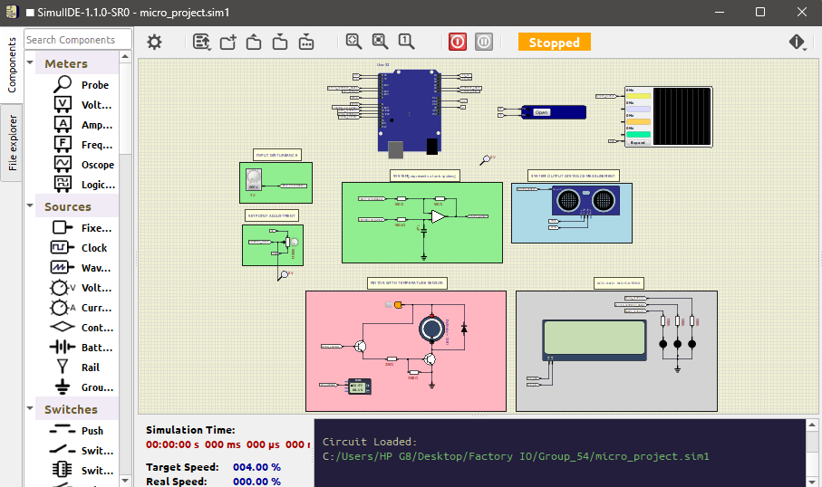
  
  iv. Load Firmware

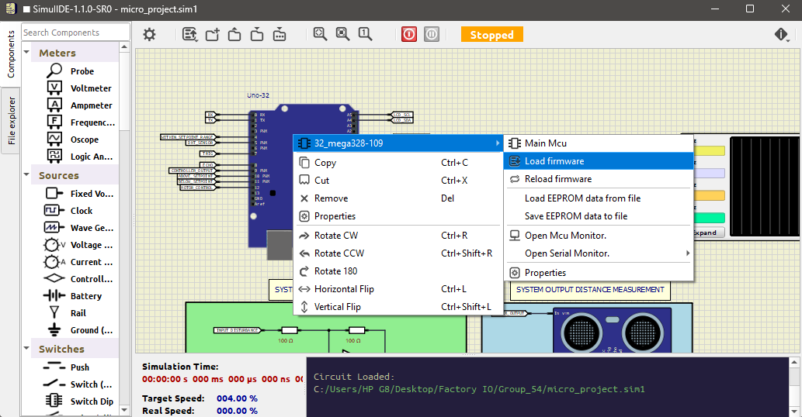
  
  v. Select Firmware (Select the Firmware.hex file)
  
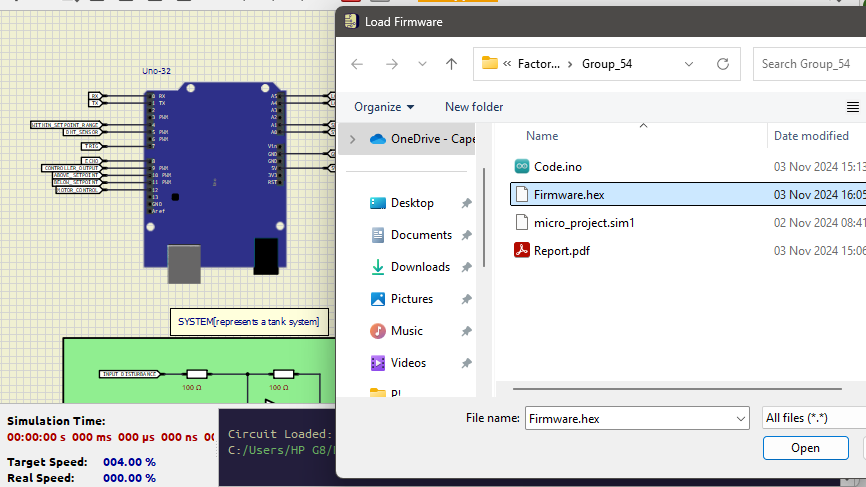
  
  vi. Confirm Firmware IS Loaded

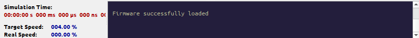
  
* Observe how the motor, LEDs, and sensors interact virtually before physical implementation.

---

## 🔄 Project Workflow

1. **Derive mathematical model** of the system.
2. **Simulate in MATLAB** to design PID controller.
3. **Tune parameters** (Kp, Ki, Kd).
4. **Implement in Arduino code**.
5. **Export HEX file** and load into **SimulIDE**.
6. **Run full system simulation** before hardware testing.

---

## 🚧 Future Improvements

* Implement full **PID control** (with derivative action).
* Add support for **multiple sensors** and advanced safety logic.
* Integrate with a **web dashboard** for IoT monitoring.
* Optimize controller for **real hardware testing**.

---

## 📜 License

This project is licensed under the MIT License - see the [LICENSE](LICENSE) file for details.

